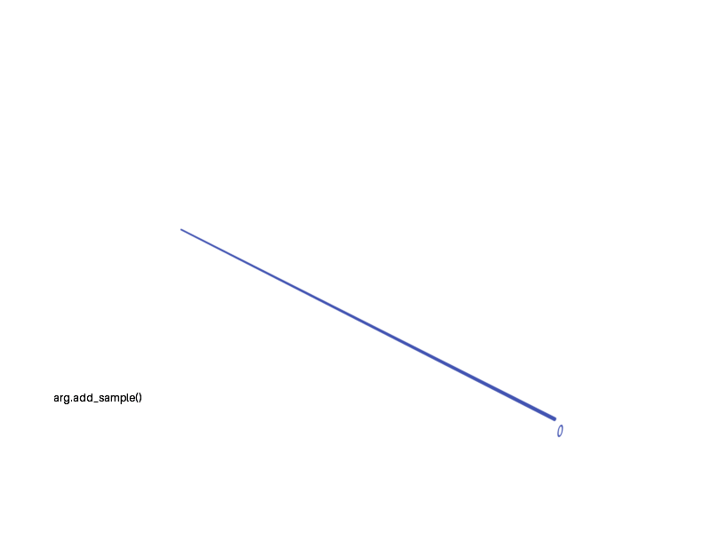

# arg-needle-lib-blender

Code to generate Blender files and renders from [arg-needle-lib](https://github.com/PalamaraLab/arg-needle-lib) internals. This is a diagnosis aid to help me get a handle on the structure of Ancestral Recombination Graphs (ARGs) whilst adding new tests and features, in particular support for polytomy in arg-needle-lib.

## Example usage

```sh
pip install -r requirements.txt
python example_sim.py
open sim.blend # Open in Blender
```

Example screenshot of internals of ARG in Blender. ARG nodes are rendered - somewhat counterintuitively - as lines, and ARG edges are rendered as quads between these lines. This represents arg-needle-lib's structure, where each nodes span a [start, end) range along the genome, and can have many edges to other nodes, where where each edge also has a [start, end) range.


The sample nodes in the ARG are the blue lines, and internal nodes are green. The spanning edges between these nodes are rendered as translucent quads, blue if coming off a sample node, becoming redder higher up in the graph.

## Export images and blender files

The `ArgToBlender` class processes the ARG and attempts to scale and position the nodes for an intuitive render. Setting `blender_out_file` will create a `.blend` file and set the viewport to this camera at startup. Setting `png_out_file` will create a `.png` file using this camera, for example:


## Animated threading

You can override the camera position and target which is useful when rendering an ARG changing over time. The `example_threading.py` does this to generate a series of images for particular threading cases, which are collated into an animated gif:


