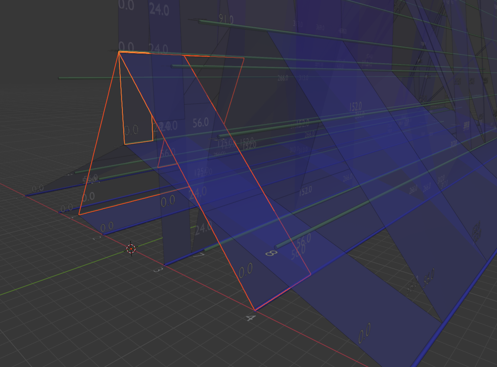

# arg-needle-lib-blender

Blender output to help visualise ARG internals. This is diagnosis aid whilst
adding new features, in particular support for polytomy in arg-needle-lib.

## Example usage

```sh
pip install -r requirements.txt
python example_sim.py
open sim.blend # Open in Blender
```

Example screenshot of internals of ARG. Nodes in an arg can contain many spans
of edges. To render this they are shown - somewhat counterintuitively for
nodes - as lines, with samples in blue and internal nodes in green. Edges span
subregions between start and end range along nodes so these are rendered as
rectangles, blue at base shifting to red for higher node IDs.



The selection in Blender here shows four overlapping edge spans coming off one
node. Text can be disabled in code by setting `SHOW_TEXT` to False.

## Export images and blender files

By default `ArgToBlender` will attempt to position a camera to best render
the ARG. Setting `blender_out_file` will set the view to this camera at startup.
Setting `png_out_file` will automatically render using this camera, for example:


The `example_threading.py` script renders a series of these to help intuit the
threading process.